Ever wondered what happens when you send a message over the internet? Let's dive into the story of a UDP packet - from birth to death.

## Table of Contents

- [Table of Contents](#table-of-contents)
- [What's UDP?](#whats-udp)
- [Birth: Creating the Packet](#birth-creating-the-packet)
- [Leaving Home: The Network Stack](#leaving-home-the-network-stack)
- [First Steps: Local Network](#first-steps-local-network)
- [The Big Journey: Internet Routing](#the-big-journey-internet-routing)
- [Arrival: Reaching the Destination](#arrival-reaching-the-destination)
- [What Could Go Wrong?](#what-could-go-wrong)
  - [Common Packet Disasters:](#common-packet-disasters)
- [UDP vs TCP: Why Choose UDP?](#udp-vs-tcp-why-choose-udp)
- [The Journey Ends](#the-journey-ends)

## What's UDP?

UDP stands for User Datagram Protocol. Think of it as the postal service of the internet - you write a message, put it in an envelope with an address, and send it off. Unlike its more careful cousin TCP, UDP doesn't wait for confirmation that your message arrived. It's fast, simple, and sometimes a bit reckless.

## Birth: Creating the Packet

Let's say you're playing an online game and your character shoots a fireball. Your game needs to tell the server "Player fired fireball at coordinates (100, 200)".

Here's what happens when the UDP packet is born:

Basically: your game asks to send data, the system wraps it in a UDP envelope with addressing info, and sends it off into the network.

## Leaving Home: The Network Stack

Our little packet now needs to travel through the network stack. It's like getting dressed for a journey - each layer adds its own wrapper:

At each layer, our packet gets wrapped like a Russian doll: (Babushka ;))

## First Steps: Local Network

Now our packet is ready to leave your computer. First stop: the local network! (LAN)

Your router looks at the packet and thinks: "Hmm, this packet wants to go to 203.0.113.42. That's not on my local network (192.168.1.x), so I'll send it to my gateway."

## The Big Journey: Internet Routing

This is where the real adventure begins! Our packet enters the vast internet and starts hopping from router to router:

At each router, the same process happens:

Each router:
1. **Looks at the destination IP** (203.0.113.42)
2. **Checks its routing table** ("How do I get there?")
3. **Forwards the packet** to the next best router
4. **Decreases TTL by 1** (Time To Live - prevents infinite loops)

## Arrival: Reaching the Destination

Finally! Our packet reaches the destination server:

The destination server unwraps our packet like opening a present: 🎁

## What Could Go Wrong?

UDP is called "unreliable" for a reason. Here are some things that might happen to our poor packet:

```mermaid
graph TD
    A[Packet Sent] --> B{Router Congested?}
    B -->|Yes| C[DROPPED! 💀]
    B -->|No| D{Network Cable OK?}
    D -->|Damaged| E[CORRUPTED! 🤕]
    D -->|Good| F{TTL Expired?}
    F -->|Yes| G[TIMEOUT! ⏰]
    F -->|No| H[Delivered! 🎉]
    
    style C fill:#ff6666
    style E fill:#ffaa66
    style G fill:#ffff66
    style H fill:#66ff66
```

### Common Packet Disasters:

1. **Dropped**: Router gets overwhelmed and tosses our packet in the digital trash
2. **Lost**: Takes a wrong turn and ends up in the internet equivalent of Bermuda Triangle
3. **Corrupted**: Gets mangled by electrical interference
4. **Delayed**: Stuck in traffic (network congestion)

## UDP vs TCP: Why Choose UDP?

You might wonder, "Why use UDP if it's unreliable?" Here's the comparison:

**UDP is perfect for:**
- **Gaming**: Fast reactions matter more than perfect data
- **Video streaming**: A few dropped frames won't kill you
- **DNS lookups**: Just ask again if it fails
- **Real-time communication**: Speed over perfection

**TCP is better for:**
- **File downloads**: You want every single byte
- **Web browsing**: Missing parts of a webpage is annoying
- **Email**: You definitely want your messages to arrive

## The Journey Ends

And that's the life of our UDP packet! From a simple game action to electrical signals racing through fiber optic cables at the speed of light, crossing continents in milliseconds.

Our packet lived fast and free - no guarantees, no confirmations, just pure speed. It might have made it to the server where the fireball hit its target, or it might be lost forever in the digital void. That's the UDP way: "Send it and forget it!"

Next time you're gaming online or watching a video, remember the billions of little UDP packets making their perilous journey across the internet, living their brief but exciting lives in the name of keeping your digital world running smoothly.
