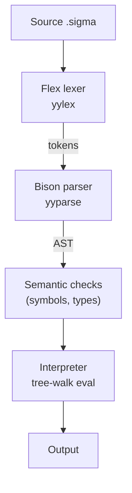
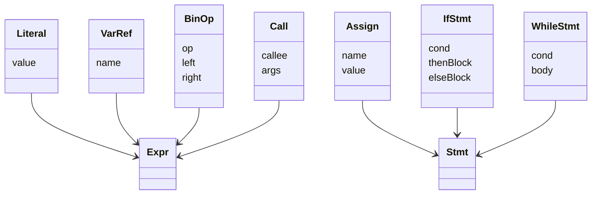

# Why I built SIGMA

I’ve always wanted to build a programming language end to end—tokens, grammar, AST, evaluation, the whole pipeline. The final push came from Tsoding’s excellent video about making a language with Flex and Bison. As I wrote in the repo:

> This project was heavily inspired by [Tsoding's video](https://www.youtube.com/watch?v=pz3UgkyhgXk) on building a custom programming language with Flex and Bison. It wouldn't be possible without him.

SIGMA is a tiny, Gen‑Z flavored language implemented in C. It has integers, arithmetic, conditionals/loops, functions, arrays, and even a light class-like system—plus some fun “brainrot” keywords. The goal was educational: make something real enough to be fun to use, but simple enough to understand.

> Repo <https://github.com/OfekiAlm/sigma-lang>
{: .prompt-tip }


## The toolchain: Flex and Bison

- Flex is a lexer generator. You describe tokens using regular-expression rules, and Flex generates `yylex()`—a C function that turns raw characters into a stream of tokens.
- Bison is a tool that helps you build a parser for your language. You write out the grammar rules—how statements and expressions should look—and Bison turns those rules into C code that can read tokens (from the lexer) and build a tree-like structure (called an AST) representing your program. It also handles things like operator order, grouping, and error messages for you.

Why use them?


Why use them?

- They save me from writing a lot of complicated code by hand. Instead of building a lexer and parser from scratch, I can just describe the rules and let Flex and Bison do the hard work.
- They handle tricky stuff like operator precedence and grouping, so my language works the way people expect.
- Flex and Bison work together smoothly: Flex breaks the input into tokens, and Bison uses those tokens to build a tree (AST) that represents the program.


## Big picture



The first milestone was making arithmetic expressions and printing work. From there I layered on variables, control flow, functions, arrays, and simple classes.


## Language highlights

- Variables: `alpha x = 10;`
- Print: `rizz x;`
- Booleans: `noCap` (true), `cap` (false)
- Control flow: `sus (...) { ... } else { ... }`, `bussin (...) { ... }`
- Functions: `vibes name(args) { ... }`
- Arrays: `alpha a[10]; a[0] = 42;`
- Classes: `squad Name { ... }` with `dizz` as a `this`-like reference

Here’s a tiny taste:

```text
alpha n = 5;

vibes fact(x) {
	sus (x <= 1) { return 1; }
	else { return x * fact(x - 1); }
}

rizz fact(n); ~ prints 120
```


## Expressions, precedence, and associativity


When you write math expressions in code, you expect certain rules: multiplication happens before addition, and parentheses can change the order. This is called operator precedence and associativity.

Bison makes handling these rules simple. Instead of writing lots of complicated code, you just declare how operators should behave. For example:

- **Precedence**: Multiplication and division (`*`, `/`) happen before addition and subtraction (`+`, `-`).
- **Associativity**: If you have several operators of the same type, like `a - b - c`, they group from left to right.

Here's how the grammar for math expressions is usually structured:

1. **Expression**: Something like `a + b` or `a - b`, or just a term.
2. **Term**: Something like `a * b` or `a / b`, or just a factor.
3. **Factor**: A negative value (like `-a`), something in parentheses (like `(a + b)`), a number, or a variable name.

So, the parser knows that in `a + b * c`, it should do the multiplication first, then the addition.

## Tokens and the lexer (Flex)

The lexer turns characters into tokens while attaching semantic values for identifiers and numbers. A simplified rule set looks like:

```text
// keywords
"alpha"     -> TOKEN_ALPHA
"rizz"      -> TOKEN_RIZZ
"noCap"     -> TOKEN_TRUE
"cap"       -> TOKEN_FALSE
"sus"       -> TOKEN_IF
"bussin"    -> TOKEN_WHILE
"vibes"     -> TOKEN_FUNC
"squad"     -> TOKEN_CLASS
"dizz"      -> TOKEN_THIS

// identifiers and integers
[a-zA-Z_][a-zA-Z0-9_]*  -> TOKEN_IDENT (yylval.sval = strdup(yytext))
[0-9]+                  -> TOKEN_INT   (yylval.ival = atoi(yytext))

// operators and separators: + - * / == <= >= != && || ! ( ) { } [ ] , ; =
```

Whenever Flex returns a token, Bison sees it via `yylex()` and populates `yylval` to carry the value into grammar actions.


## Grammar and AST (Bison)

Each Bison production constructs AST nodes in its action block. I keep the AST minimal and composable—nodes for literals, variables, binary/unary ops, assignments, blocks, if/while, calls, function defs, array indexing, class members, etc.



A production like assignment might look conceptually like:

$$ Assign \;\to\; \text{IDENT} 
\; '=' \; Expr \; ';' $$

with a C action that builds an `Assign` node from `IDENT` and the `Expr` subtree.


## Name resolution and runtime

I keep a straightforward symbol table for variables and functions. At runtime, the interpreter walks the AST:

1. Evaluate expressions recursively (numbers, variables, array indexing, member access, calls).
2. Execute statements (assignments, if/while, blocks) with lexical scopes.
3. Functions get their own environments; `return` unwinds through an exception-like mechanism.
4. For classes, instances are maps from field names to values; methods are functions closed over `dizz`.

This keeps the implementation small and debuggable while still feeling like a real language.


## Key takeaways
- Tsoding is a fantastic teacher and his video was invaluable. He's great!
- Start tiny, then layer features. Arithmetic → variables → control flow → functions → arrays/classes.
- Let Bison handle precedence; keep grammar rules declarative and actions focused on building AST nodes.
- Keep the AST small and the interpreter boring. Boring is good for correctness.
- Great error messages matter. Tsoding’s workflow showed practical tricks for printing token context and using Bison’s `error` token for recovery.

## References

- Code: https://github.com/OfekiAlm/sigma-lang
- Tsoding’s video: https://www.youtube.com/watch?v=pz3UgkyhgXk
- Flex: https://westes.github.io/flex/manual/
- Bison: https://www.gnu.org/software/bison/manual/
